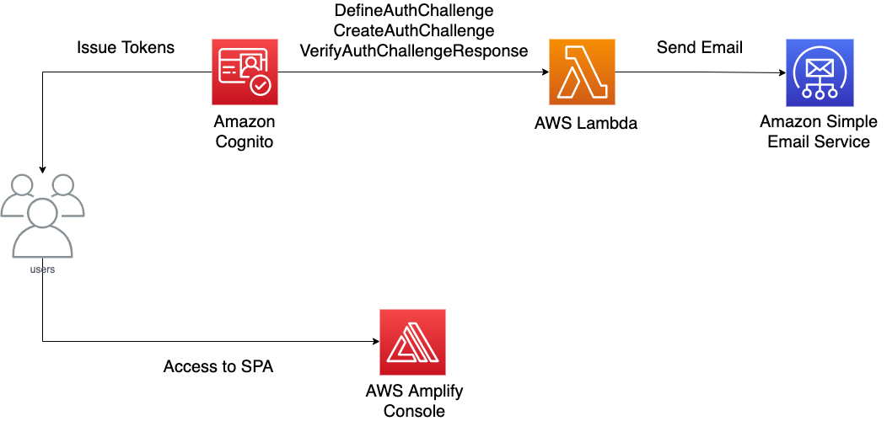
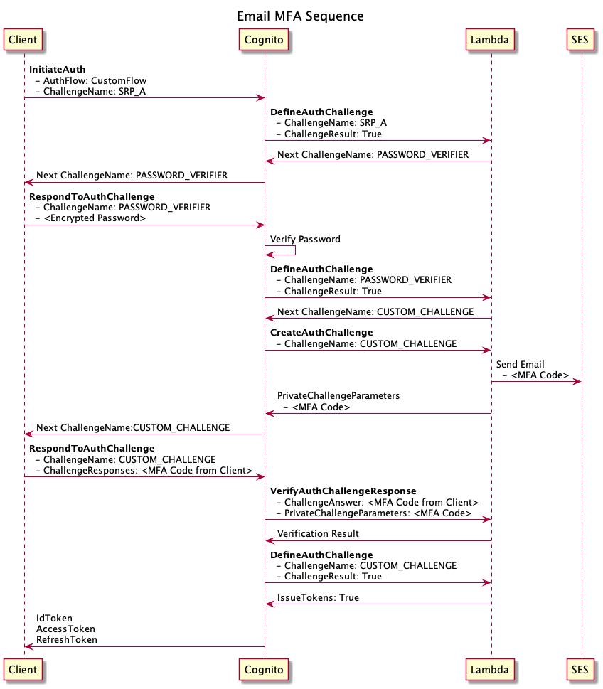
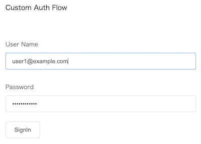
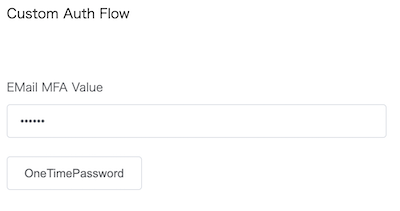

# Cognito Custom Authentication

## 概要

Amazon Cognito におけるカスタム認証フローの実装サンプルです。サインインを行う SPA (Single Page Application)、および Cognito の認証シーケンスをカスタマイズする AWS Lambda の実装が含まれます。

本実装サンプルでは、カスタム認証の例として、従来のユーザー名とパスワードの認証に加え、ユーザーのメールアドレスに対して 6 桁の認証コードを送信し、正否を確認したうえでサインインを許可する多要素認証を実現しています。
## アーキテクチャ

フロントエンドとなる SPA は Vue.js 2.6、AWS Lambda の各関数は Python 3.8 にて実装されています。



### Cognito トリガー

本サンプルでは、以下の 3 種類の Cognito トリガーから AWS Lambda 関数を呼び出すことにより、カスタム認証を実現しています。各 Cognito トリガーの役割は以下のとおりです。

| トリガー名 | 概要 |
| - | - |
| **認証チャレンジの定義 (DefineAuthChallenge)** | カスタム認証の際に、次の認証内容を確認するために実行されます。これによりパスワード検証の後に MFA を行う、MFA は 2 回まで失敗を許容するなど、認証の順序を定義することができます。本サンプルでは、パスワード検証ののちにメールベースでの多要素認証を行う認証フローを定義しています。 |
| **認証チャレンジの作成 (CreateAuthChallenge)** | reCAPTCHA 認証や MFA など独自の認証で実行する内容を定義します。本サンプルでは、サインインを試行するユーザーへ認証コードをメール送信する処理を実装しています。 |
| **認証チャレンジレスポンスの確認 (VerifyAuthChallengeResponse)** | 実行した独自の認証に対して、認証結果の成否を検証する関数を定義します。本サンプルでは、認証コードが正しいか検証する処理を実装しています。 |

### 認証シーケンス

クライアントがサインインを完了させるまでのシーケンス図は下記の通りです。



### 補足事項

+ メールの送信には Amazon Simple Email Service (SES) を利用しています。既定では、SES を通じて送信するメールに設定可能なアドレスは、送信元、送信先ともに SES で事前に検証したものに限られます。

  + 不特定のメールアドレスへメールを送信する場合は、[こちら](https://docs.aws.amazon.com/ja_jp/ses/latest/DeveloperGuide/request-production-access.html)のドキュメントを参照の上、SES のサンドボックス制限解除を申請してください。

## スクリーンショット





## 構築手順

### 0. Prerequisites

本実装サンプルのデプロイには以下のツール、設定が必要となります。

- AWS アカウント [https://aws.amazon.com/resources/create-account/](https://aws.amazon.com/resources/create-account/)
- AWS CLI [https://docs.aws.amazon.com/ja_jp/cli/latest/userguide/cli-chap-install.html](https://docs.aws.amazon.com/ja_jp/cli/latest/userguide/cli-chap-install.html)
- AWS CLI の設定 [https://docs.aws.amazon.com/ja_jp/cli/latest/userguide/cli-chap-configure.html](https://docs.aws.amazon.com/ja_jp/cli/latest/userguide/cli-chap-configure.html)
- AWS SAM CLI [https://docs.aws.amazon.com/ja_jp/serverless-application-model/latest/developerguide/serverless-sam-cli-install.html](https://docs.aws.amazon.com/ja_jp/serverless-application-model/latest/developerguide/serverless-sam-cli-install.html)
- Amplify CLI [https://docs.amplify.aws/cli/start/install](https://docs.amplify.aws/cli/start/install)
- Python 3.8 [https://www.python.org/downloads/](https://www.python.org/downloads/)
- npm [https://nodejs.org/en/download/](https://nodejs.org/en/download/)
- Vue CLI [https://cli.vuejs.org/#getting-started](https://cli.vuejs.org/#getting-started)
- Docker [https://docs.docker.com/get-docker/](https://docs.docker.com/get-docker/)

### 1. `email-mfa-backend` ディレクトリで、`sam build --use-container` コマンドを実行し Lambda 関数をビルドします。

```bash
$ cd email-mfa-backend
$ sam build --use-container

Starting Build inside a container
Building codeuri: functions/triggers/ runtime: python3.8 metadata: {} functions: ['EmailMFAFunction']

Fetching amazon/aws-sam-cli-build-image-python3.8 Docker container image..............................................................................................................................................................................................................................................................................................................................................................................................................................................................................................................................................................................................................................................................................................................................................................................................................................................................................................................................................................................................................................................................................................................................................................................................................................................................................................................................................................................................................................
Mounting /Users/aws/aws-samples/email-mfa-backend/functions/triggers as /tmp/samcli/source:ro,delegated inside runtime container

Build Succeeded

Built Artifacts  : .aws-sam/build
Built Template   : .aws-sam/build/template.yaml

Commands you can use next
=========================
[*] Invoke Function: sam local invoke
[*] Deploy: sam deploy --guided
```

### 2. `sam deploy --guided` コマンドを実行し AWS リソースをデプロイします。

実行時に指定するパラメータの内容は以下のとおりです。

| パラメータ | 概要 |
| - | - |
| **Stack Name** | CloudFormation のスタック名 |
| **AWS Region** | デプロイ先のリージョン |
| **Parameter SenderEmailAddress** | メール送信を行う送信元 (FROM) メールアドレス |
| **Confirm changes before deploy** | CloudFormation の変更セット機能により、変更対象となるリソースを確認してからデプロイを実施するかどうかを指定します。 |
| **Allow SAM CLI IAM role creation** | IAM ロールの作成を認めるかどうかを指定します。今回は AWS Lambda が利用する IAM ロールを新規に作成するため、`Y` を選択してください。 |
| **Save arguments to configuration file** | 更新した内容をデプロイする場合など、次回以降のデプロイで今回の入力値を再び使いまわしたい場合は `Y` を選択してください。 |
| **SAM configuration file** | 入力値の保存先となるファイル名 |
| **SAM configuration environment** | 環境名を指定します。既定値は `default` ですが、`dev` や `prod` などの環境名を指定することも可能です。指定した場合、次回以降の `sam deploy` の際に `--config-env` オプションを指定して環境名を与える必要があります。 |

```bash
$ sam deploy --guided

Configuring SAM deploy
======================

        Looking for config file [samconfig.toml] :  Not found

        Setting default arguments for 'sam deploy'
        =========================================
        Stack Name [sam-app]: email-mfa-backend-stack
        AWS Region [ap-northeast-1]: ap-northeast-1
        Parameter SenderEmailAddress [sender@example.com]: sender@example.com
        #Shows you resources changes to be deployed and require a 'Y' to initiate deploy
        Confirm changes before deploy [y/N]: y
        #SAM needs permission to be able to create roles to connect to the resources in your template
        Allow SAM CLI IAM role creation [Y/n]: Y
        Save arguments to configuration file [Y/n]: Y
        SAM configuration file [samconfig.toml]: samconfig.toml
        SAM configuration environment [default]: default
```

### 3. 作成されるリソースの一覧が表示されるので、確認ののち、`y` を入力します。

```bash
CloudFormation stack changeset
-----------------------------------------------------------------------------------------------------------------------------------------------------
Operation                             LogicalResourceId                     ResourceType                          Replacement                         
-----------------------------------------------------------------------------------------------------------------------------------------------------
+ Add                                 EmailMFAFunctionCognitoPermission     AWS::Lambda::Permission               N/A                                 
+ Add                                 EmailMFAFunctionRole                  AWS::IAM::Role                        N/A                                 
+ Add                                 EmailMFAFunction                      AWS::Lambda::Function                 N/A                                 
+ Add                                 UserPoolClient                        AWS::Cognito::UserPoolClient          N/A                                 
+ Add                                 UserPool                              AWS::Cognito::UserPool                N/A                                 
-----------------------------------------------------------------------------------------------------------------------------------------------------

Changeset created successfully. arn:aws:cloudformation:ap-northeast-1:123456789012:changeSet/samcli-deploy1616397515/6cf79cd8-3f07-4337-8313-f71ef7f11409


Previewing CloudFormation changeset before deployment
======================================================
Deploy this changeset? [y/N]: y
```

### 4. デプロイが成功すると、Cognito の Client ID および User Pool ID が表示されますので、これらを控えておきます。

```bash
-----------------------------------------------------------------------------------------------------------------------------------------------------
Outputs                                                                                                                                             
-----------------------------------------------------------------------------------------------------------------------------------------------------
Key                 CognitoUserPoolClientId                                                                                                         
Description         Cognito UserPool Client ID                                                                                                      
Value               5s7qfvilgmiifv4nafei7fcdhq                                                                                                      

Key                 CognitoUserPoolId                                                                                                               
Description         Cognito UserPool ID                                                                                                             
Value               ap-northeast-1_BTuuioGO2                                                                                                        
-----------------------------------------------------------------------------------------------------------------------------------------------------

Successfully created/updated stack - email-mfa-backend-stack in ap-northeast-1
```

### 5. 次にフロントエンドの設定に移ります。`email-mfa-frontend` ディレクトリに移動し、`4.` で出力された値をもとに `.env` ファイルを設定します。

```bash
VUE_APP_AWS_REGION="ap-northeast-1"
VUE_APP_USER_POOL_ID="ap-northeast-1_BTuuioGO2"
VUE_APP_USER_WEB_CLIENT_ID="5s7qfvilgmiifv4nafei7fcdhq"
```

### 6. フロントエンド アプリケーションのデプロイに関する設定を行います。`amplify init` コマンドを実行し、Amplify CLI が利用する S3 バケットなど、基盤となるリソースをデプロイします。

| パラメータ | 概要 |
| - | - |
| **Enter a name for the project** | このアプリケーションのプロジェクト名 |
| **Enter a name for the environment** | 環境名 |
| **Choose your default editor** | 開発に利用するエディタ |
| **Choose the type of app that you're building** | アプリの種類を `JavaScript`, `iOS`, `Flutter`, `Android` から選択します。ここでは `JavaScript` を選択します。 |
| **What javascript framework are you using** | 利用しているフレームワークを選択します。ここでは `vue` を選択します。 |
| **Source Directory Path** | ソースコードのディレクトリの位置を指定します。ここでは `src` を入力します。 |
| **Choose the type of app that you're building** | ビルドしたアプリケーションを配置する位置を指定します。ここでは `dist` を入力します。 |
| **Build Command** | アプリケーションのビルドコマンドを指定します。ここでは `npm run-script build` を入力します。 |
| **Start Command** | アプリケーションのローカル実行を行うコマンドを指定します。ここでは `npm run-script serve` を入力します。 |
| **Do you want to use an AWS profile?** | AWS アカウントにアクセスするために使っている AWS CLI のプロファイルを指定します。 |
| **Please choose the profile you want to use** | AWS CLI のプロファイル名を入力します。 |

```bash
$ amplify init

Scanning for plugins...
Plugin scan successful
Note: It is recommended to run this command from the root of your app directory
? Enter a name for the project emailmfafrontend
? Enter a name for the environment dev
? Choose your default editor: Visual Studio Code
? Choose the type of app that you're building javascript
Please tell us about your project
? What javascript framework are you using vue
? Source Directory Path:  src
? Distribution Directory Path: dist
? Build Command:  npm run-script build
? Start Command: npm run-script serve
Using default provider  awscloudformation

For more information on AWS Profiles, see:
https://docs.aws.amazon.com/cli/latest/userguide/cli-configure-profiles.html

? Do you want to use an AWS profile? Yes
? Please choose the profile you want to use default
```

実行すると以下のようなログが表示されます。

```bash
Adding backend environment dev to AWS Amplify Console app: d3en5vmk0ms18b
⠧ Initializing project in the cloud...

CREATE_IN_PROGRESS DeploymentBucket                    AWS::S3::Bucket            Mon Mar 22 2021 16:40:16 GMT+0900 (GMT+09:00)               
CREATE_IN_PROGRESS UnauthRole                          AWS::IAM::Role             Mon Mar 22 2021 16:40:16 GMT+0900 (GMT+09:00)               
CREATE_IN_PROGRESS amplify-emailmfafrontend-dev-164007 AWS::CloudFormation::Stack Mon Mar 22 2021 16:40:11 GMT+0900 (GMT+09:00) User Initiated
⠏ Initializing project in the cloud...

CREATE_IN_PROGRESS AuthRole AWS::IAM::Role Mon Mar 22 2021 16:40:16 GMT+0900 (GMT+09:00) 
⠇ Initializing project in the cloud...

CREATE_IN_PROGRESS DeploymentBucket AWS::S3::Bucket Mon Mar 22 2021 16:40:17 GMT+0900 (GMT+09:00) Resource creation Initiated
CREATE_IN_PROGRESS AuthRole         AWS::IAM::Role  Mon Mar 22 2021 16:40:17 GMT+0900 (GMT+09:00) Resource creation Initiated
CREATE_IN_PROGRESS UnauthRole       AWS::IAM::Role  Mon Mar 22 2021 16:40:17 GMT+0900 (GMT+09:00) Resource creation Initiated
⠏ Initializing project in the cloud...

CREATE_COMPLETE AuthRole   AWS::IAM::Role Mon Mar 22 2021 16:40:36 GMT+0900 (GMT+09:00) 
CREATE_COMPLETE UnauthRole AWS::IAM::Role Mon Mar 22 2021 16:40:36 GMT+0900 (GMT+09:00) 
⠋ Initializing project in the cloud...

CREATE_COMPLETE amplify-emailmfafrontend-dev-164007 AWS::CloudFormation::Stack Mon Mar 22 2021 16:40:41 GMT+0900 (GMT+09:00) 
CREATE_COMPLETE DeploymentBucket                    AWS::S3::Bucket            Mon Mar 22 2021 16:40:38 GMT+0900 (GMT+09:00) 
✔ Successfully created initial AWS cloud resources for deployments.
✔ Initialized provider successfully.
Initialized your environment successfully.

Your project has been successfully initialized and connected to the cloud!

Some next steps:
"amplify status" will show you what you've added already and if it's locally configured or deployed
"amplify add <category>" will allow you to add features like user login or a backend API
"amplify push" will build all your local backend resources and provision it in the cloud
"amplify console" to open the Amplify Console and view your project status
"amplify publish" will build all your local backend and frontend resources (if you have hosting category added) and provision it in the cloud

Pro tip:
Try "amplify add api" to create a backend API and then "amplify publish" to deploy everything
```

### 7. `amplify hosting add` コマンドを使い、アプリケーションをデプロイするためのホスティングサービスとして、Amplify Console を追加します。

| パラメータ | 概要 |
| - | - |
| **Select the plugin module to execute Hosting with** | ホスティングサービスを選択します。ここでは `Amplify Console` を選択します。 |
| **Choose a type** | デプロイ方法を選択します。ここでは `Manual deployment` を選択します。 |

```bash
$ amplify hosting add

? Select the plugin module to execute Hosting with Amplify Console (Managed hosting with custom domains, Continuous deployment)
? Choose a type Manual deployment

You can now publish your app using the following command:

Command: amplify publish
```

### 8. `amplify publish` コマンドを実行し、Amplify Console へアプリケーションをデプロイします。

```bash
$ amplify publish

✔ Successfully pulled backend environment dev from the cloud.

Current Environment: dev

| Category | Resource name  | Operation | Provider plugin   |
| -------- | -------------- | --------- | ----------------- |
| Hosting  | amplifyhosting | Create    | awscloudformation |

Tag Changes Detected
? Are you sure you want to continue? Yes
⠹ Updating resources in the cloud. This may take a few minutes...

UPDATE_IN_PROGRESS amplify-emailmfafrontend-dev-164007 AWS::CloudFormation::Stack Mon Mar 22 2021 16:44:17 GMT+0900 (GMT+09:00) User Initiated
⠸ Updating resources in the cloud. This may take a few minutes...

CREATE_IN_PROGRESS hostingamplifyhosting AWS::CloudFormation::Stack Mon Mar 22 2021 16:44:23 GMT+0900 (GMT+09:00) 
⠙ Updating resources in the cloud. This may take a few minutes...

CREATE_IN_PROGRESS hostingamplifyhosting AWS::CloudFormation::Stack Mon Mar 22 2021 16:44:24 GMT+0900 (GMT+09:00) Resource creation Initiated
UPDATE_IN_PROGRESS AuthRole              AWS::IAM::Role             Mon Mar 22 2021 16:44:23 GMT+0900 (GMT+09:00)                            
UPDATE_IN_PROGRESS UnauthRole            AWS::IAM::Role             Mon Mar 22 2021 16:44:23 GMT+0900 (GMT+09:00)                            
UPDATE_IN_PROGRESS DeploymentBucket      AWS::S3::Bucket            Mon Mar 22 2021 16:44:23 GMT+0900 (GMT+09:00)                            
⠹ Updating resources in the cloud. This may take a few minutes...

CREATE_IN_PROGRESS amplify-emailmfafrontend-dev-164007-hostingamplifyhosting-RMHDWH1AETKQ AWS::CloudFormation::Stack Mon Mar 22 2021 16:44:24 GMT+0900 (GMT+09:00) User Initiated
⠸ Updating resources in the cloud. This may take a few minutes...

CREATE_COMPLETE    AmplifyBranch AWS::Amplify::Branch Mon Mar 22 2021 16:44:32 GMT+0900 (GMT+09:00)                            
CREATE_IN_PROGRESS AmplifyBranch AWS::Amplify::Branch Mon Mar 22 2021 16:44:32 GMT+0900 (GMT+09:00) Resource creation Initiated
CREATE_IN_PROGRESS AmplifyBranch AWS::Amplify::Branch Mon Mar 22 2021 16:44:29 GMT+0900 (GMT+09:00)                            
⠴ Updating resources in the cloud. This may take a few minutes...

CREATE_COMPLETE hostingamplifyhosting AWS::CloudFormation::Stack Mon Mar 22 2021 16:44:35 GMT+0900 (GMT+09:00) 
⠹ Updating resources in the cloud. This may take a few minutes...

UPDATE_COMPLETE UnauthRole AWS::IAM::Role Mon Mar 22 2021 16:44:42 GMT+0900 (GMT+09:00) 
UPDATE_COMPLETE AuthRole   AWS::IAM::Role Mon Mar 22 2021 16:44:42 GMT+0900 (GMT+09:00) 
⠹ Updating resources in the cloud. This may take a few minutes...

UPDATE_COMPLETE                     amplify-emailmfafrontend-dev-164007 AWS::CloudFormation::Stack Mon Mar 22 2021 16:44:47 GMT+0900 (GMT+09:00) 
UPDATE_COMPLETE_CLEANUP_IN_PROGRESS amplify-emailmfafrontend-dev-164007 AWS::CloudFormation::Stack Mon Mar 22 2021 16:44:46 GMT+0900 (GMT+09:00) 
UPDATE_COMPLETE                     DeploymentBucket                    AWS::S3::Bucket            Mon Mar 22 2021 16:44:43 GMT+0900 (GMT+09:00) 
✔ All resources are updated in the cloud


Publish started for amplifyhosting

> frontend@0.1.0 build
> vue-cli-service build


⠧  Building for production...

 WARNING  Compiled with 3 warnings                                                                                                              16:45:25

 warning  

asset size limit: The following asset(s) exceed the recommended size limit (244 KiB).
This can impact web performance.
Assets: 
  js/chunk-vendors.e7a1b349.js (2.52 MiB)

 warning  

entrypoint size limit: The following entrypoint(s) combined asset size exceeds the recommended limit (244 KiB). This can impact web performance.
Entrypoints:
  app (2.73 MiB)
      css/chunk-vendors.c470e980.css
      js/chunk-vendors.e7a1b349.js
      js/app.4e050955.js


 warning  

webpack performance recommendations: 
You can limit the size of your bundles by using import() or require.ensure to lazy load some parts of your application.
For more info visit https://webpack.js.org/guides/code-splitting/

  File                                   Size                                                  Gzipped

  dist/js/chunk-vendors.e7a1b349.js      2583.83 KiB                                           703.91 KiB
  dist/js/app.4e050955.js                7.47 KiB                                              2.33 KiB
  dist/css/chunk-vendors.c470e980.css    204.40 KiB                                            32.79 KiB

  Images and other types of assets omitted.

 DONE  Build complete. The dist directory is ready to be deployed.
 INFO  Check out deployment instructions at https://cli.vuejs.org/guide/deployment.html
```

最後にアプリケーションへアクセスするための URL が表示されます。

```bash
✔ Zipping artifacts completed.
✔ Deployment complete!
https://dev.d3en5vmk0ms18b.amplifyapp.com
```

### 9. Cognito へユーザーを作成し、上記の URL よりサインインします。AWS CLI から行う場合、以下のコマンドを実行することでユーザーの作成が可能です。

```bash
$ aws cognito-idp admin-create-user --user-pool-id ap-northeast-1_BTuuioGO2 --username user1@example.com --temporary-password HogeFuga123! --user-attributes Name=email,Value=user1@example.com Name=email_verified,Value=true --message-action SUPPRESS

$ aws cognito-idp admin-set-user-password --user-pool-id ap-northeast-1_BTuuioGO2 --username user1@example.com --password HogeFuga123! --permanent
```

## Security

See [CONTRIBUTING](CONTRIBUTING.md#security-issue-notifications) for more information.

## License

This library is licensed under the MIT-0 License. See the [LICENSE](LICENSE) file.
